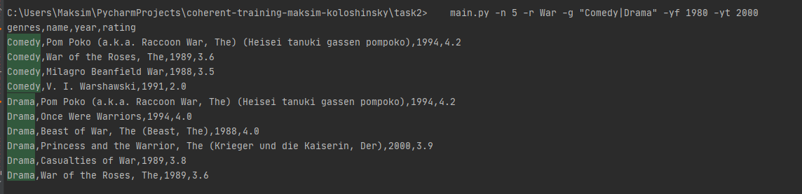

About project:
====================
The project is used to find movies depending on the query results

The installation instructions assume that Python is installed on your device.
If you don't have Python installed, follow the link and download it.
https://www.python.org/downloads/

Usage
====================
main.py [-n] number [-r] regex [-g] genres [-yf] year_from [-yt] year_to  

    -n      --number        Limit of returned items
    -r      --regex         Regex to search by name
    -g      --genres        Search by genres    
    -yf     --year_from     Search for movies from the year
    -yt     --year_to       Search for movies up to a year

Examples
====================
    main.py -n 5 -r War -g "Comedy|Drama" -yf 1980 -yt 2000

    
    main.py -yf 2000 -yt 2020
    main.py  -g "Crime|Drama" -yf 1991 -c movies
    

Notes
====================
The files to search for data are located in the resources folder