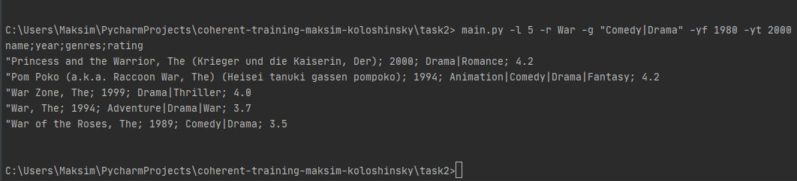

About project:
====================
The project is used to find movies depending on the query results

The installation instructions assume that Python is installed on your device.
If you don't have Python installed, follow the link and download it.
https://www.python.org/downloads/

Usage
====================
main.py [-l] limit [-r] regex [-g] genres [-yf] year_from [-yt] year_to  [-csv] True  

    -l          Limit of returned items
    -r          Regex to search by name
    -g          Search by genres    
    -yf         Search for movies from the year
    -yt         Search for movies up to a year
    -csv        Writing the result to a csv file

Examples
====================
    main.py -l 5 -r War -g "Comedy|Drama" -yf 1980 -yt 2000

    
    main.py -yf 2000 -yt 2020
    

   
    main.py  -g "Crime|Drama" -yf 1991 -c movies

​

Notes
====================
The files to search for data are located in the resources folder